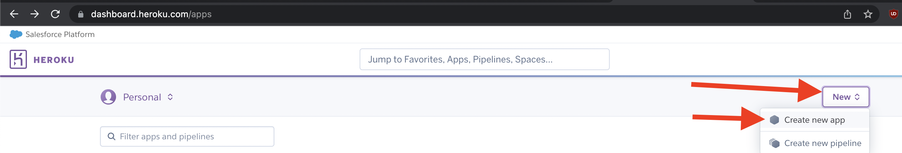
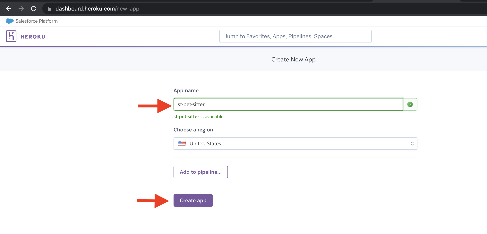
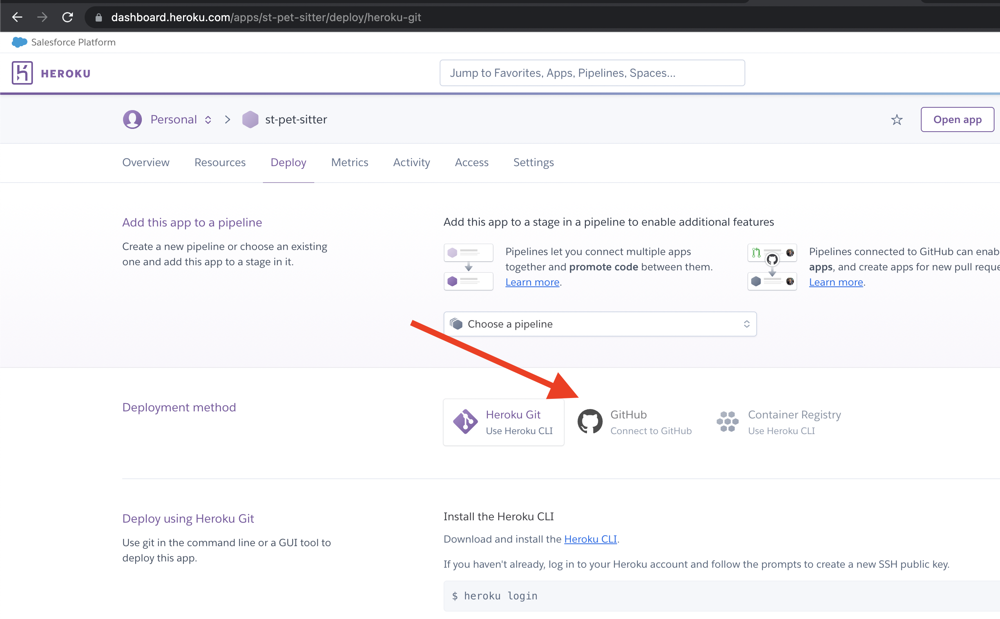
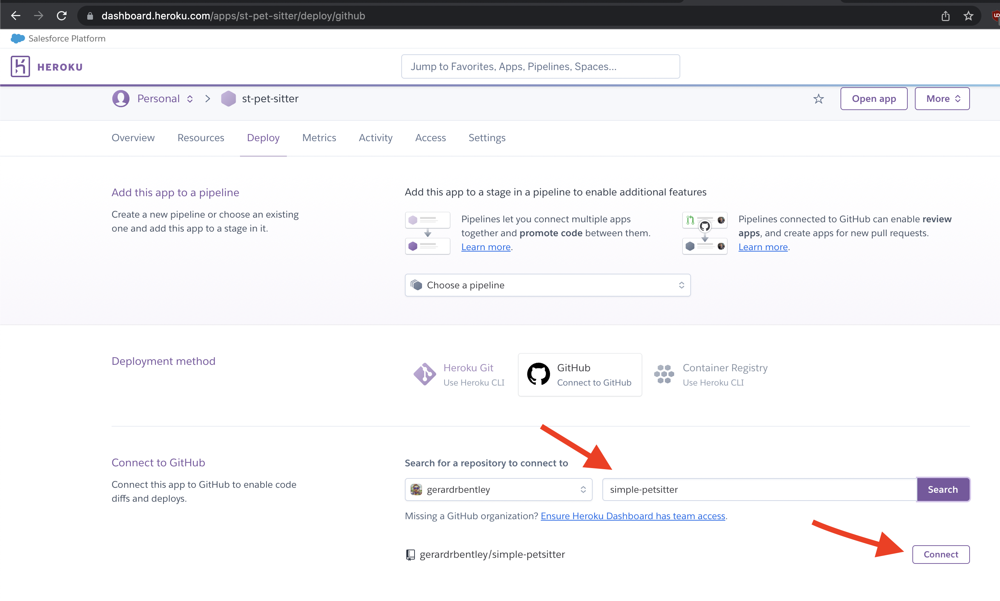
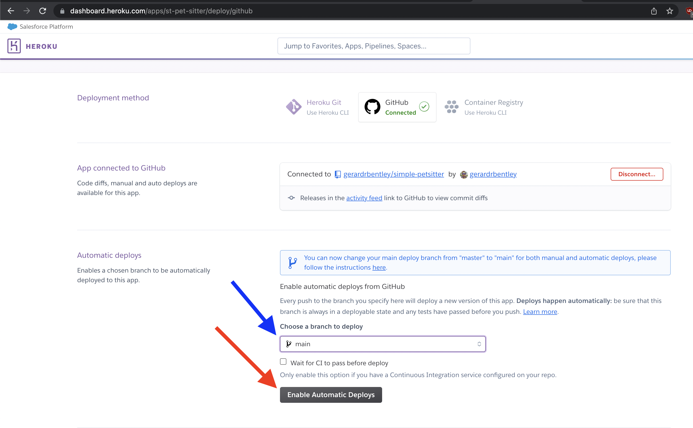
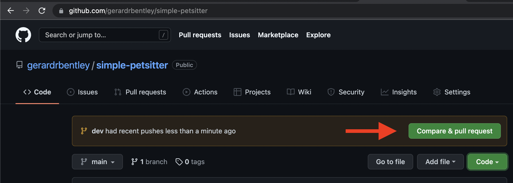
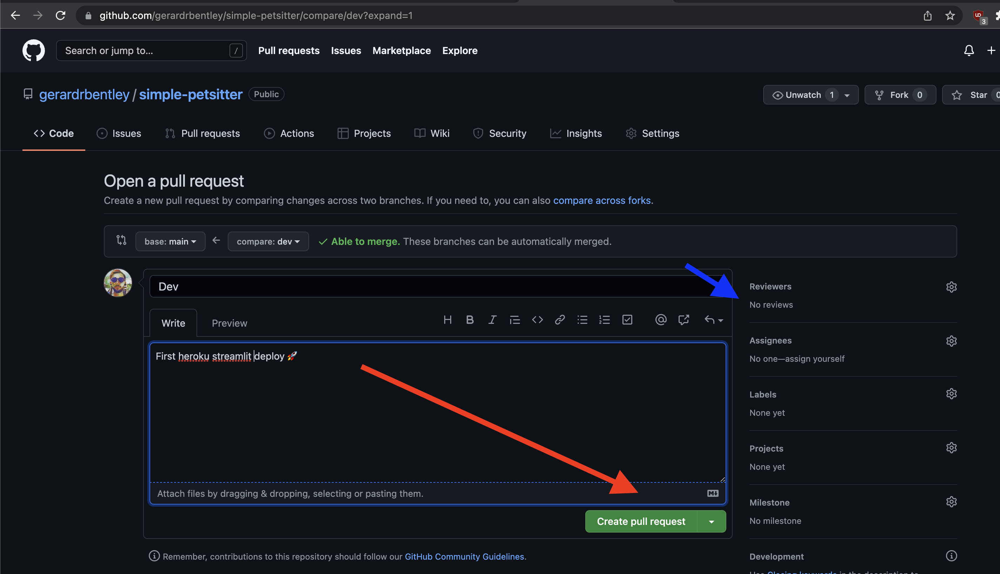
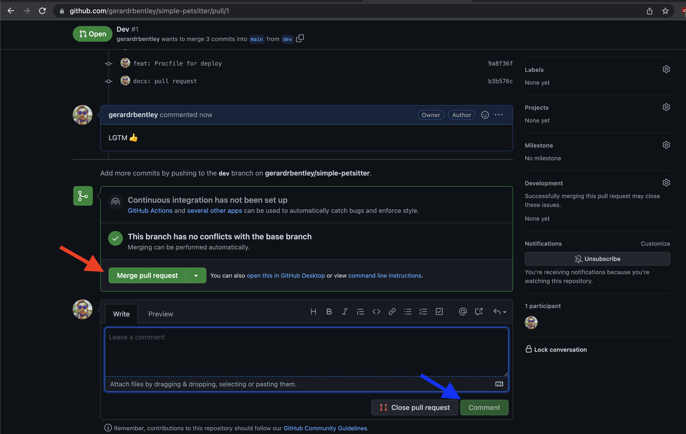
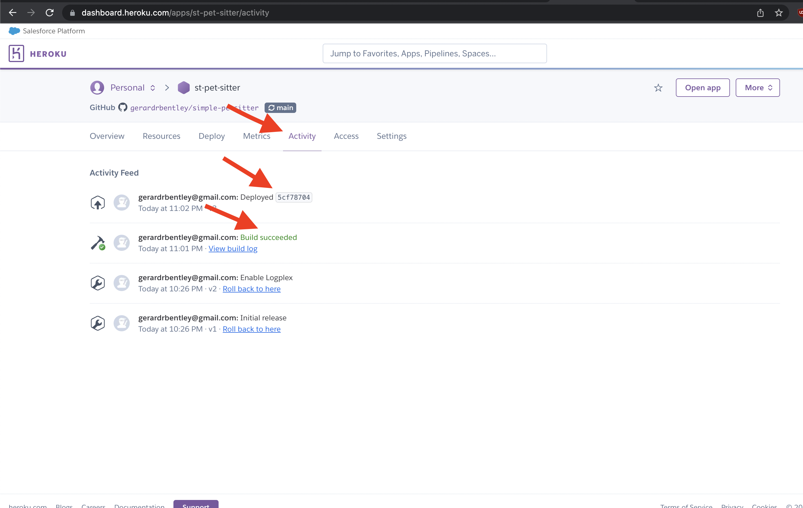

# Streamlit App

Streamlit app deployed to Heroku

- Barebones version 

    [](https://heroku.com/deploy?template=https://github.com/gerardrbentley/simple-petsitter/tree/barebones)

## What's this?

- `README.md`: This Document! To help you find your way around
- `streamlit_app.py`: The main app that gets run by streamlit
- `requirements.txt`: Pins the version of packages needed (handled by Heroku)
- `Procfile`: Special file to tell Heroku how to run our app (`streamlit run`)
- `LICENSE`: Follows streamlit's use of Apache 2.0 Open Source License
- `.gitignore`: Tells git to avoid comitting / scanning certain local-specific files

## Local Setup

Assumes working python installation and some command line knowledge ([install python my way](https://tech.gerardbentley.com/python/beginner/2022/01/29/install-python.html)).

```sh
git clone git@github.com:gerardrbentley/simple-petsitter.git
cd simple-petsitter
python -m venv ./venv
. ./venv/bin/activate
# ./venv/Scripts/activate for Windows
python -m pip install -r requirements.txt
streamlit run streamlit_app.py
```

## Heroku

Launch: see `Procfile`.

Gets port from Heroku.
Doesn't create credentials or try to open browser

```sh
streamlit run streamlit_app.py --server.port $PORT --server.headless true
```

### Manual App Creation

Heroku CLI is also popular (see [this streamlit recommended guide](https://towardsdatascience.com/quickly-build-and-deploy-an-application-with-streamlit-988ca08c7e83)

- New App on [heroku](https://dashboard.heroku.com/apps)



- Give it a name that's available



- Select Github deployment for automated



- Find your Github repo if you've connected this way



- Choose your branch for automatic deploys. (You can push code to other branches for safe keeping without overwriting the live site)



### Making Updates

Recommended branch and merge for small additions and features:

```sh
git checkout -b dev
git add changed_stuff.py
git commit -m "feat: new changed stuff!"
# If others commit to main and you can handle your own merge hell
# git fetch -a
# git rebase origin/main
git push origin dev
```

(See [gitlab guide](https://docs.gitlab.com/ee/topics/git/git_rebase.html) for more on rebasing interactively and force-pushes)

Then head to github to merge the `dev` branch into `main` with a pull request. (or just merge it yourself locally and force push to `main` if you're solo...)



(If you don't see a message like the above one, check out the [github guide](https://docs.github.com/en/pull-requests/collaborating-with-pull-requests/proposing-changes-to-your-work-with-pull-requests/creating-a-pull-request) for creating a pull request with the "Pull Requests" to the right of "Code")

Continue with creating the pull request.
Optionally request other users review your changes before they go live.



Once you're sure things are good, merge it!
Optionally delete the branch; if you want a long running dev branch that's fine.
If you want small named feature branches that's fine too and usually more descriptive.



Confirm the update to `main` is processed by checking the Heroku "Activity" tab for your app.
You're looking (praying...) for "Build Succeeded" and "Deployed" (the bit after it is the git commit).



Check out the build log to get more info on the guts of your deployment!

If everything seems good click the "Open App" button and check out your live streamlit app hosted on Heroku!

It ain't much (yet), but it's a live site with a Continuous Integration pipeline ready for changes.


